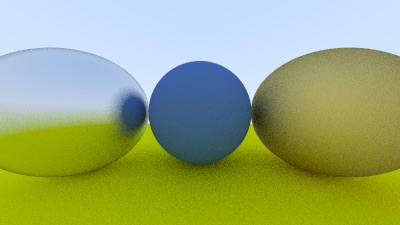

# Rust Ray Tracer

This project is an implementation of the **Ray Tracing in One Weekend** series by Peter Shirley, adapted to the Rust programming language. The original series guides readers through building a simple ray tracer from scratch over a weekend using C++. This Rust adaptation follows the same concepts and progression but utilizes Rust's features.

## About

Ray tracing is a rendering technique used to generate realistic images by tracing the path of light as pixels in an image plane and simulating how it interacts with virtual objects. **Ray Tracing in One Weekend** provides a hands-on introduction to ray tracing, making it accessible even to those with minimal experience in computer graphics.

<!-- ## Current Phase

This project is currently in phase 1, following the concepts introduced in the first book of the **Ray Tracing in One Weekend** series. -->

## Resources

- [Original "Ray Tracing in One Weekend" series](https://raytracing.github.io/)
- [Rust programming language](https://www.rust-lang.org/)
